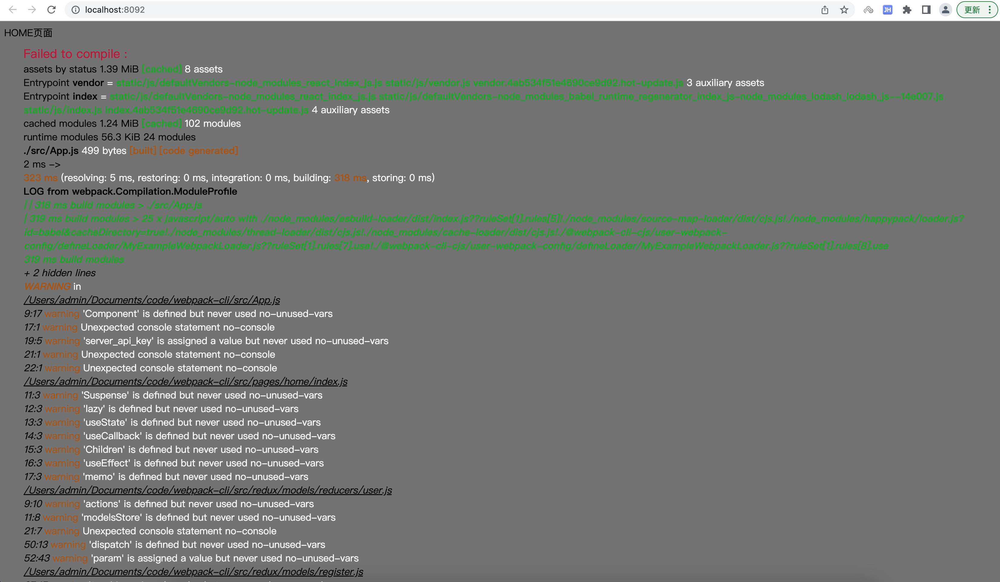
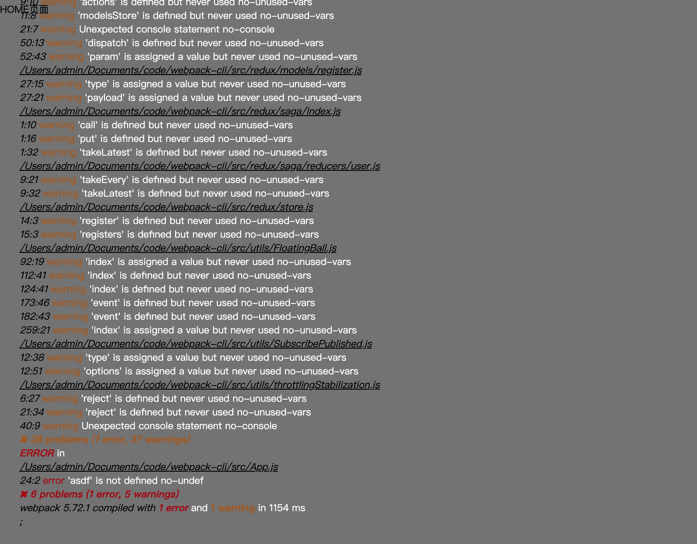
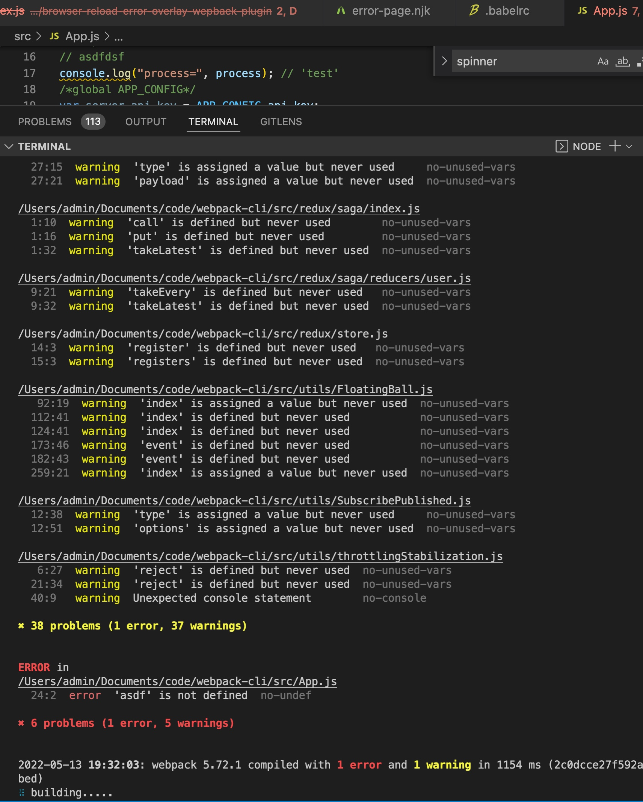

# browser-reload-error-overlay-wepback-plugin

this is Webpack compiles the refresh plug-in and compile error logging plug-in,I found a lot of plugins on Github，error-overlay-wepback-plugin Both rely on React and are not very good for decoupling, so I wrote my own plugin to configure error-overlay and Browser-reload separately

## The installation

```
 yarn add  browser-reload-error-overlay-wepback-plugin
 or
 npm i --save browser-reload-error-overlay-wepback-plugin
 or

```

## Use the code

webpack.config.js

```

const BrowserReloadErrorOverlayWepbackPlugin = require("browser-reload-error-overlay-wepback-plugin");

 plugins: [
         // ...
        new BrowserReloadErrorOverlayWepbackPlugin(),
     // ...
    ]
```


## Compile the log picture of the error









The author：yao guan shou (姚观寿)


